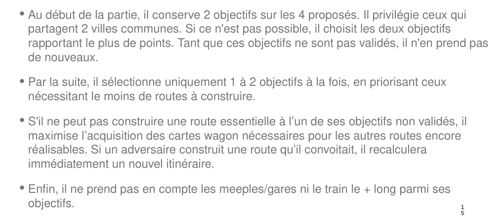
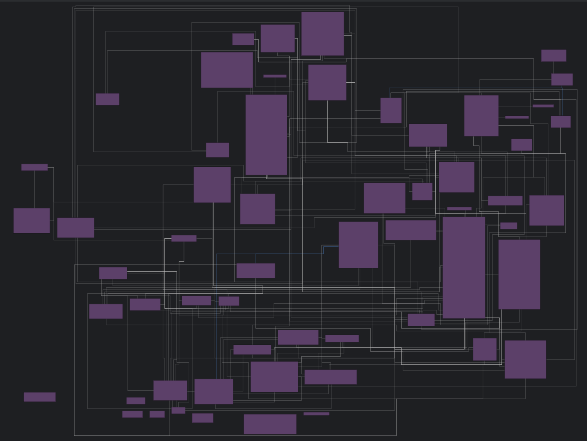
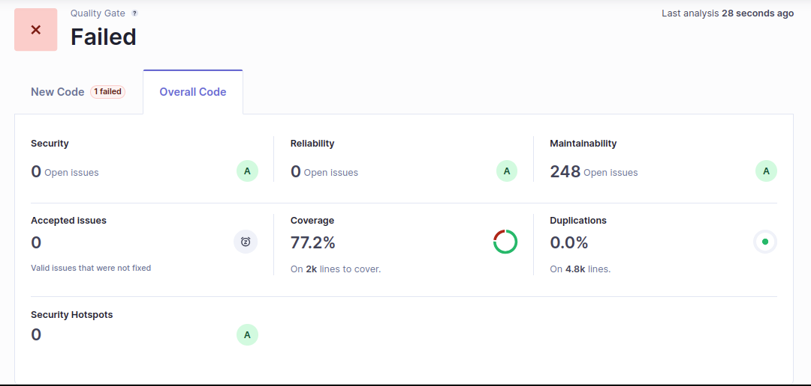

# Transmission du Projet

## 1. Point d’avancement

### Fonctionnalités réalisées

TODO DONE 
- [x] Les bots peuvent connecter deux villes sur n'importe quelle route.
- [x] Les bots peuvent tirer des cartes destinations, wagons selon les règles du jeu- [] [x] Les bots peuvent collecter des meeples dans les villes rattachées aux connections qu'ils achètent, une seule fois par ville, selon les règles.
- [x] Une planche de jeu complète peut être créée, avec toutes ses villes, toutes ses connections et tous les meeples de chaque ville. Il s'agit de la carte du Ticket To Ride Germany.
- [x] Les bots peuvent jouer sur cette map, effectuer des actions et altérer l'état du jeu après chaque tours.
- [x] Les bots peuvent gagner des points selon les règles du jeu (ie en achetant des connections, en complétant des cartes destinations, en récoltant des meeples).
- [x] Les bots peuvent savoir si leur carte destination est complétée.
- [x] Les bots utilisent l'algorithme de Dijkstra pour trouver le plus court chemin entre deux villes.
- [ ] Un des bots (répertoire Overlap) est encore en phase d'intégration.
- [ ] Plusieurs tests sont encore à implémenter (65% de coverage)
- [ ] Tests 

### Gestion des logs
- Lors de l'execution de :
  (linux) mvn exec:java -Dexec.args="--demo" ; (windows) mvn exec:java "-Dexec.args=--demo"
. Un detail complet de l'inventaire de chaque bot est fait (logger) à chaque tours, avec un message indiquant quelle action il a fait.
- Lors de l'execution de : (linux) mvn exec:java -Dexec.args="--2thousands" ; (windows) mvn exec:java "-Dexec.args=--2thousands"
. 2000 parties s'executent et à la fin de chaque 1000 parties, un winrate et un score moyen pour chaque bot est affiché.

### Statistiques en CSV
- L'ensemble de la gestion des statistiques CSV se trouve dans la classe StatsAnalyse 
- Le fichier CSV est toujours présent et doit être vidé à la main quand on veut prendre des nouvelles stats 
- Une lecture du fichier CSV est effectuée pour connaitre les stats actuels.
  Puis une première écriture ce fait pour mettre à jour les informations des bots déjà connue.
  Enfin une deuxième écriture est réalisé pour ajouter les stats des nouveaux bots.
- Données stockées : 
  - Le nom du bot
  - Son nombre de parties jouées
  - Son nombre de victoires
  - Son taux de victoire
  - Son nombre de points total gagné

### Bot spécifique et comparaison

- l'image provient du cours de M Bounouas Nassim, il s'agit du bot que nous devions implémenter pendant la semaine de rush finale. 

Nous avons nommé le bot "Overlap", car il cherche les cartes destinations où les villes se superposent lors du premier tirage. 
Nous avons implémenté celui-ci avec une classe BotOverlap, et plusieurs classes “Managers” telles que PathManager. Les Managers s'occupent de gérer les entités utilisées par le bot, et les choix du bot au niveau des pioches ou des connexions à acheter. Le bot, lui, s'occupe de faire des choix en fonction de ce qu'il a en main, tels que choisir les cartes destinations à réaliser, et le choix de l'action à faire chaque tour : piocher une carte wagon, piocher une carte destination, ou acheter une connexion. 
Cela permet de réutiliser la logique, telle que Dijkstra, la pioche de cartes wagons de couleurs adaptées, ou de cartes destinations possibles à réaliser, pour d'autres bots potentiels. Cela permet aussi de rendre le code plus lisible, plus facile à tester, et plus facile à modifier.

- Comparaison avec le meilleur bot développé :
  Le bot de la semaine finale (BotOverlap) gagne beaucoup plus de parties que notre premier bot. C'est surement dû au fait que notre premier bot n'est pas capable
de finir une partie normalement, il va s'entêter à essayer d'acheter des connections même si il n'a pas assez de carte. Donc le bot va piocher dans le paquet de cartes wagons jusqu'a qu'il n'y en ait plus.
Donc dans une partie où plusieurs MidBot s'affrontent, la fin de partie est géré par un cran d'arrêt qui au bout de 5 rounds d'inactivité, stop la partie.

## 2. Architecture et qualité

### Architecture du projet
Un point important à connaître est que la classe Player, ne doit pas être vu comme un joueur mais plutôt comme
une classe qui contient les données. Le refactor du nom de la classe aurait été trop risqué aussi proche de la dead line
Aussi, les méthodes présentes dans l'abstract Bot, sont suffisantes pour que n'importe quel autre bot qui hérite de cette
classe puisse jouer aux Aventuriers du Rail Allemagne.
Les classes GameView, GameEngine peuvent paraître obscures, en fait, elles servent d'intermédiaire pour que les bots puissent
influencer sur l'état de la partie, accéder aux données etc. 
L'objectif derrière ce choix d'implémentation était d'empêcher des bots tricheurs de pouvoir agir n'importe comment sur leur score, 
leurs cartes wagons etc... 

Image d'illustration du poid en méthode de chaque classe :

### Documentation et ressources
La javadoc se situe dans le dossier javadoc à la racine du projet

### Qualité du code
Pour le moment nous avons 72.9% de coverage des tests sur le projet d'après sonarQube.
Les classes les moins testées sont celles au début de a liste:
- DestinationCardDrawManager : 0.0%
- EmptyDestinationDecks : 0.0%
- Main : 0.0%
- MeepleSelectorManager : 0.0%
- WagonDrawManager : 0.0%
- WrongPlayerException : 0.0%
- BotOverlap : 2.4%
- PlayerOwnedMap : 5%
- StatsAnalyse : 63.8%
- Bot : 66.7%
- PathManager : 72.6%
- ScoreGeneralManager : 76.3%
- Connection : 77.8%
- DestinationCard : 81.8%
- GameEngine : 82.4%
- MidBot : 83.2%
- Meeple : 86.4%
- ScoreMeepleManager : 87%
- Player : 87.2%
- Card : 87.5%
- TypeOfCards : 87.5%
- City : 89.7%
- GamesStatisticsLogger : 93.5%
- LoggerDetailed : 97.2%
- Deck : 97.3%
- Djikstra : 97.4%
- Le reste est à 100%

Les choses à refaire si on avait une quantité de temps et moyens illimité :
- GameEngine, car le principe de sécurité qu'on a essayé de suivre n'est pas totalement au top
- GameBoard, il y a de la dupication de code
- Bot, la classe abstraite bot mérite d'être refaite, il y a certaines choses qui font plus vraiment sens. Certaines méthodes prennent en paramètre des objets qui ne font pas sens finalement.
- Explorer la piste de la creation des decks et des cartes à travers un json.

Résultats sonar :

La quality gate fail car le coverage n'est pas assez élevé (<80%).
## 3. Répartition des tâches
- 100/100/100/100
---

> **Note** : N’hésitez pas à contacter l’ancienne équipe en cas de besoin.

